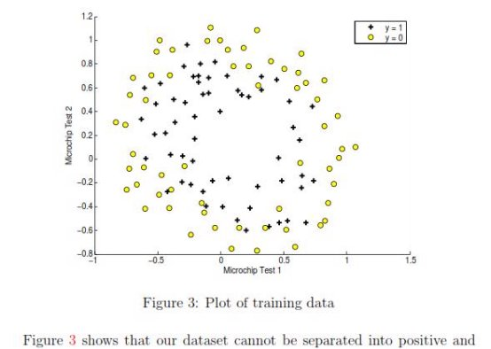
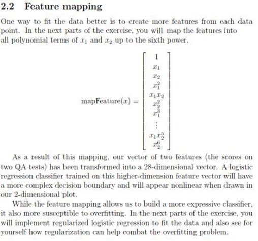

\1. Logistic Regression 

**1.1 Visualizing the Data** 

Before starting to implement any algorithm, it is always good to visualize the data if possible. Write a code to display a figure like Figure 1, where the axes are the two exam scores, and the positive and negative examples are shown with different markers. 

Implement the sigmoid function. Your code should also work with Matrices and vectors. For a matrix, your function should perform the sigmoid function on every element. 

**1.2.3 Learning Parameters and plotting** 

Implement the gradient descent and find optimal parameters. On optimal parameters you should see the cost is about 0.203. Use final theta value to plot the decision 

boundary on the training data, resulting in a figure similar to Figure 2. 

For the logistic regression task, write the code to plot a  

With initial values of thetas (initialized to all zeros), you should see that the cost is about 0.693. 

1. **Learning Parameters and Plotting** 

Implement the gradient descent and find optimal parameters. Use final theta value to plot the decision boundary on the training data, resulting in a figure similar to Figure 

\4. 

2. **Try Different Regularization Parameters:** 

